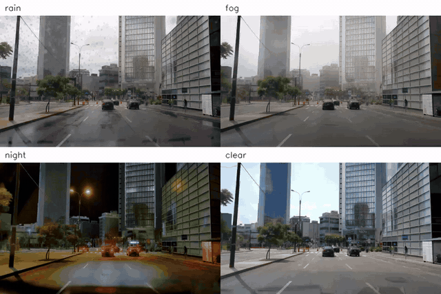
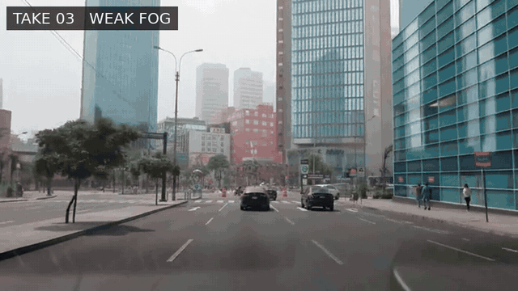

# How Do You Test Weather You Cannot Schedule?

**A visual lesson on verifier-guided Best-of-N scaling for generative video**

[Open the live lesson](https://cut-ai-edu.pages.dev/) | [Start offline](START_HERE.md) | [Teaching guide](docs/TEACHING_GUIDE.md) | [Reproducibility record](docs/REPRODUCIBILITY.md)

Prepared for the NeurIPS 2026 Education Track by Alicia Chua, Pawarit Laosunthara, and Eric Tang, Anyscale.

[](interactive/media/montage-rain-fog-night-clear.mp4)

*One recorded scene, restaged across rain, fog, night, and clear conditions. Click the preview for the MP4.*

## Start in 60 seconds

1. Open the [live interactive lesson](https://cut-ai-edu.pages.dev/).
2. Watch how spatial control keeps the drive recognizable while the requested condition changes.
3. Vote between two candidates before seeing the rubric.
4. Increase the candidate budget from N=1 to N=8.
5. Change the judge weights and observe whether the selected clip changes.

The whole lesson is also available offline in `interactive/`.

## The idea

Rare driving conditions are difficult to capture safely, repeatedly, and on demand. A controllable world-generation model can transform one recorded drive into several candidate videos while spatial guidance helps preserve the road layout and object placement.

This resource uses NVIDIA Cosmos Transfer 2.5 as a worked implementation. Eight fog candidates are generated from the same source, prompt, parameters, and edge control, with only the random seed changing. Learners then apply a transparent rubric and discover the central lesson:

> Generation creates options. The judge turns options into a decision.

Best-of-N spends additional inference compute to search a larger candidate pool. A larger pool can reveal a better candidate when the judge recognizes the properties the application needs. It can also expose or amplify judge weakness because more candidates create more opportunities to exploit an incomplete proxy. Increasing N is useful only when both the candidate distribution and the selection rule are fit for purpose.


## Try the lesson

The browser lesson is the primary artifact. It includes the source drive, edge-control video, eight fog candidates, rain and snow extensions, a blind vote, an adjustable selector, a quality-gate explanation, and a closing montage.

To use it offline:

```bash
python -m http.server 8000
```

Open `http://localhost:8000/interactive/`. The core lesson needs no account, network connection, GPU, model download, or Python package installation.

## Explore the selector

The displayed scores are fixed illustrative visual annotations, not outputs from a live video-language model. They make the selection rule observable and editable. Human review, deterministic vision metrics, VLM-assisted review, and hard rejection gates are presented as complementary components of a stronger evaluation process.

[](interactive/media/judge_reel.mp4)

*Several valid-looking generations can fail in different ways. Click the preview for the candidate reel.*

Run the dependency-free selector:

```bash
python source/scoring.py --n 8
python source/scoring.py --n 8 --weather 100 --structure 0 --stability 0
python source/scoring.py --n 8 --reject take07
```

The optional notebook `notebooks/selector_lab.ipynb` examines candidate budget, mission-dependent weights, proxy failure, and rating uncertainty without regenerating video.

## Regenerate the video candidates

The `generation/` directory contains the Ray execution wrapper, experiment definitions, and driver-side tests used to launch independent Cosmos Transfer 2.5 samples in parallel. It does not include model weights or the upstream Cosmos source tree.

Full regeneration requires:

- access to the NVIDIA Cosmos Transfer 2.5 model and acceptance of its terms
- a compatible NVIDIA GPU environment
- a Ray cluster with shared storage visible to every worker
- the upstream Cosmos Transfer 2.5 source checkout

The recorded lesson run used Cosmos source revision `2ff49d0`, the `edge/distilled` configuration, 4 denoising steps, guidance 4, 93 frames, edge weight 0.65, and four NVIDIA L40S GPUs. The exact model-weight revision was not recorded, so byte-identical regeneration is not claimed.

Edit the shared paths in `generation/experiments/*.yaml`, then validate before launching:

```bash
export PYTHONPATH="$PWD/generation"
python -m cosmos_ray plan generation/experiments/directors_cut.yaml
python -m cosmos_ray run generation/experiments/directors_cut.yaml --engine actor-pool -n 4
python -m cosmos_ray run generation/experiments/weather_replication.yaml --engine actor-pool -n 4
```

Guardrails are enabled by default in this public runner. See [generation/README.md](generation/README.md) for environment setup and command details.

## Repository map

| Path | Contents |
| --- | --- |
| `interactive/` | Self-contained browser lesson and compressed videos |
| `docs/` | Teaching guide, worksheet, answer key, rubric, accessibility, provenance, and reproducibility notes |
| `data/` | Fixed illustrative selector annotations |
| `notebooks/` | Hardware-free selector analysis |
| `source/` | Compact scoring example, lesson configurations, and sanitized manifests |
| `generation/` | Cosmos Transfer 2.5 and Ray execution wrapper, configs, and tests |
| `pdf/` | Printable teaching guide, worksheet, and answer key |
| `references/` | Research and implementation references |

## Suggested paths

| If you are... | Start here | Time |
| --- | --- | ---: |
| A first-time learner | [Live lesson](https://cut-ai-edu.pages.dev/) | 5 to 15 min |
| An educator | [Teaching guide](docs/TEACHING_GUIDE.md) and [worksheet](docs/LEARNER_WORKSHEET.md) | 15 to 40 min |
| Reviewing the selector | [Rubric and scoring](docs/RUBRIC_AND_SCORING.md) and [notebook](notebooks/selector_lab.ipynb) | 15 min |
| Checking evidence | [Reproducibility record](docs/REPRODUCIBILITY.md) and [media provenance](docs/MEDIA_PROVENANCE.md) | 10 min |
| Regenerating candidates | [Generation guide](generation/README.md) | Environment dependent |

## Scope and limitations

This is an educational demonstration of generation, evaluation, and selection. It is not an autonomous-driving benchmark, a validated AV evaluator, a claim of physical realism, or a vehicle-safety certification. No downstream perception or planning system was evaluated. The small example pool and illustrative annotations should be inspected, challenged, and replaced when adapting the lesson to another application.

## Upstream resources

- [NVIDIA Cosmos Transfer 2.5 source](https://github.com/nvidia-cosmos/cosmos-transfer2.5)
- [NVIDIA Cosmos Transfer 2.5 model page](https://huggingface.co/nvidia/Cosmos-Transfer2.5-2B)
- [Full references](references/REFERENCES.bib)

## License and attribution

Original educational content is licensed under CC BY 4.0. Original code is licensed under Apache 2.0. Third-party software, model materials, source media, generated media, names, and trademarks remain subject to their applicable upstream terms. See [LICENSE_SCOPE.md](LICENSE_SCOPE.md), [THIRD_PARTY_NOTICES.md](THIRD_PARTY_NOTICES.md), and [docs/MEDIA_PROVENANCE.md](docs/MEDIA_PROVENANCE.md).
